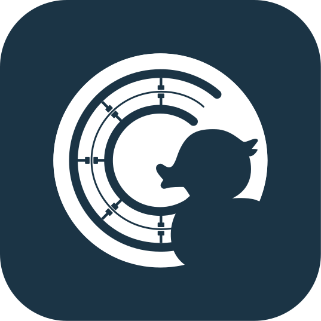
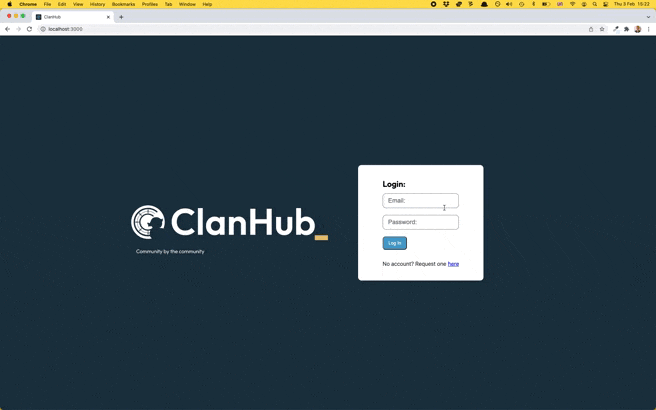

<div align="center">
  <a href="https://github.com/sf-adams/ClanHub">
    
  </a>
  <h1>ClanHub</h1>

A platform that extends the community of CodeClan, allowing Students and Staff to share insights, experiences and opportunities. As an open source, decentralized community, ClanHub hopes to help those throughout their whole CodeClan journey. Whether student or staff, everyone has something to share, or someone new to meet.

 

[Report Issue](https://github.com/sf-adams/ClanHub/issues)
·
[CodeClan](https://codeclan.com/)

</div>

## Features
- Feed and Forum, categorised and searchable
- Layered authentication so that Admin, users and non-users all have different levels of access
- Request Login details when new to the CodeClan community
- Profile section with LinkedIn and GitHub details

## Tech Stack
- JavaScript
- React
- Axios
- Spring Boot H2
- Java 11
- SASS CSS
- Various NPM libraries (npm install is required, as directed in 'Getting Started')

## Getting Started
1. In `IntelliJ IDEA CE` or other IDE:

```zsh
- run ClanHub Application
```

2. In `client` folder on new tab:

```zsh
Your local machine terminal:
- npm install
- npm start (should be listening on port 3000)
```

## The Team

Currently there are two of us responsible for the first draft of ClanHub. All further contributors will be added here:

<div align="center">
  <a href="https://github.com/O-Marsters-1997">@O-Marsters-1997</a>
  •
  <a href="https://github.com/sf-adams">@sf-adams</a>
</div>

## Contribute
1. Clone repo and create a new branch:

```zsh
- git checkout https://github.com/sf-adams/ClanHub -b name_for_new_branch
```

2. Make changes and test

3. Submit Pull Request with comprehensive description of changes

## Full Brief

### Minimum Viable Product

We have chosen to create a content-sharing and networking platform. Admin staff will create a profile, which will then be sent to users, where they can identify with any number of options (Cohort, GitHub, LinkedIn, Portfolio site link). As a key feature, our web app will center around a forum, allowing for the posting of information, which can be categorized and voted on.

1. **Forum**: Users will be able to create, read, update and delete posts, as well as add votes for content they like. The first version will contain a limited number of categories, as well as limited sorting features. We would also like to have the following features: 
    - When you click on a forum post, you will be taken to a separate post page, with the ability to make comments
    - Users can see who made a post, and click on their file to be taken to the profile page of that user
2. **Authentication/Authorisation** - Users will be able to sign up and log in to their account, with different users having different levels of access.
3. **Job Section** - For those in the process of job hunting, or simply looking to see what jobs are available with partners, this section will be able.
4. **Open Source** - To allow for Students or Staff to make improvements to the site, through a Feature Request Section, or at least through the GitHub repository.
5. **Design** - CodeClan Theme, CC Colour Palette, Mobile-First Design.

### Extensions

Identified below are ideas for further development. If there is a feature that you could add, please go to the feature request section or get in touch!

1. **Extended Access**: With users allocated a Cohort by staff, the system can work out whether a student is before, during or after their CodeClan learning experience, or a member of staff.
2. **Rubber Duck** - Voting system throughout the forum, and potentially elsewhere (with the react icon for plastic duck).
3. **Search Bar** - To help users who are looking for a post on a specific topic, without having to go through the various category filters.
4. **Mentoring** - Profiles have the option to pick themselves as a mentor, so that a user looking for extra advice, or simply another connection on LinkedIn, a connection can be made.A user could be able to mark in their profile whether they are looking for a mentor or someone to mentor. 
5. **Blog** - Users can submit blog content - an admin can review a blog post, and can either accept or reject the incoming blog post.
6. **Alumni Area** - So that users can add other alumni or connect through LinkedIn.
6. **Extras** - Some additional ideas:
    - Tech Calendar
    - Job Postings
    - Getting Started coding area for newbies
    - Tips and tricks section (or even just a category on the forum)
    - Follow button
